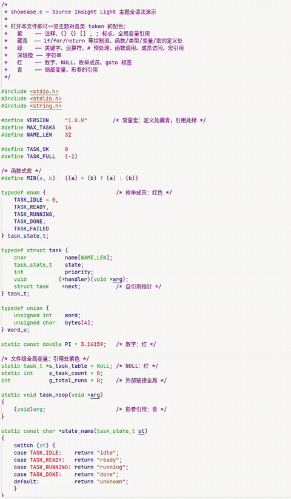

# Source Insight Colors · VS Code

For C developers who miss Source Insight: you can finally use the Source Insight color scheme in VS Code.
The UI reuses VS Code's built-in **Light Modern** theme; only code token colors are replaced, no bold.

[简体中文](README.zh-CN.md)

## Directory Layout

```
theme-sourceinsight/
├── package.json                        # extension manifest
└── themes/
    └── source-insight-light.json       # the theme itself
```

## Prerequisites

- Linux + VS Code
- Network access for C development (to download the clangd binary)

---

## Step 1: Install the Theme

Copy the whole directory into VS Code's local extensions folder
(note: the destination directory must keep the name `theme-sourceinsight`):

```bash
cp -r /path/to/theme-sourceinsight ~/.vscode/extensions/theme-sourceinsight
```

Restart VS Code, then select the **Source Insight Light** theme.

> At this point the colors are already active. However, the
> "definition vs. reference" distinction for C/Go requires a language server — read on.

## Step 2: C/C++ Support (clangd)

### 2.1 Install the clangd extension

```bash
code --install-extension llvm-vs-code-extensions.vscode-clangd
```

### 2.2 Install the clangd binary

```bash
curl -fL -o /tmp/clangd.zip \
  https://github.com/clangd/clangd/releases/download/18.1.3/clangd-linux-18.1.3.zip
unzip -q /tmp/clangd.zip -d ~/.local/
~/.local/clangd-linux-18.1.3/bin/clangd --version   # should print a version
```

> Note: the extracted directory is named `clangd-linux-18.1.3` (with hyphens).
> If you have root access, you can also `sudo apt install clangd` and set
> `clangd.path` below to `clangd` (resolved via PATH).

### 2.3 Configure settings.json

In `~/.config/Code/User/settings.json`, add:

```json
"clangd.path": "/home/<your-username>/.local/clangd-linux-18.1.3/bin/clangd",
```

If you also have Microsoft's C/C++ extension (cpptools) installed, disable its
IntelliSense to avoid conflicts with clangd
(**debugging still works and continues to use cpptools**):

```json
"C_Cpp.intelliSenseEngine": "disabled",
"C_Cpp.enhancedColorization": "disabled"
```

### 2.4 (Optional, Recommended) Improve Parsing Accuracy for C Projects

Add one flag when configuring a CMake project to generate
`compile_commands.json` in the project root:

```bash
cmake -DCMAKE_EXPORT_COMPILE_COMMANDS=ON ...
```

Without it, clangd falls back to "guessing" with default flags. Colorization
still works; only header-related diagnostics may occasionally be wrong.

## Step 3: Go Support (gopls)

### 3.1 Install the Go extension

```bash
code --install-extension golang.go
```

No need to install the gopls binary manually — the extension installs it
automatically to `~/go/bin/` the first time you open a `.go` file.

### 3.2 Key Setting

**Since gopls v0.22.0 there is a regression: semantic tokens are empty by
default**, which shows up as function calls not getting their category color.
You must enable it explicitly in settings.json (note: the `uiSemanticTokens`
option from older tutorials has been renamed — using it raises an
"unexpected setting" error):

```json
"gopls": {
    "semanticTokens": true
}
```

Restart VS Code after saving.

## Step 4 (Optional): Recommended Settings

```json
"editor.inlayHints.enabled": "off"      // hides the gray "a:" "b:" parameter name hints at call sites
```

## Full settings.json Reference

```json
{
    "workbench.colorTheme": "Source Insight Light",
    "clangd.path": "/home/<your-username>/.local/clangd-linux-18.1.3/bin/clangd",
    "C_Cpp.intelliSenseEngine": "disabled",
    "C_Cpp.enhancedColorization": "disabled",
    "gopls": { "semanticTokens": true },
    "editor.inlayHints.enabled": "off"
}
```

---

Check against the color table:

| Element | Color |
|---|---|
| Comments | Purple |
| Keywords / operators / `.` `->` | Green |
| Control flow: `if` `for` `return` etc. | Navy |
| `#include` `#define` (including `#`) | Green |
| Strings | Orange (burnt orange `#a63d00`) |
| Numbers / `NULL` | Red |
| Function / type / variable / macro **definitions** | Navy |
| Function calls, macro references, member access | Green |
| Local variables / parameters at **reference sites** | Cyan |
| Global variable references (C only) | Purple |
| Enum members | Red |
| `() {} [] , ;` | Purple |

Go follows the same scheme: function definitions navy, calls green,
variables cyan, package names dark gray (namespace references also dark
gray), constants red.

## Known Limitations (VS Code platform limits, not configuration issues)

1. **No light-yellow string background**: VS Code does not render token-level
   background colors, so SI's `#ffffbb` string highlight cannot be reproduced
2. **Constant macros are not red**: clangd does not distinguish constant macros
   (`#define N 3`) from function-like macros — references are all colored as
   macro green (in SI, constant macro references are red)
3. **Go global variables**: gopls semantic tokens carry no global/local marker,
   so Go package-level variables and local variables share the same cyan
   (C-side global variables are purple, as expected)
4. No bold anywhere — matching Source Insight's mono mode

## Uninstall

```bash
rm -rf ~/.vscode/extensions/theme-sourceinsight
```

Also remove the related settings above from settings.json.

## Sample

